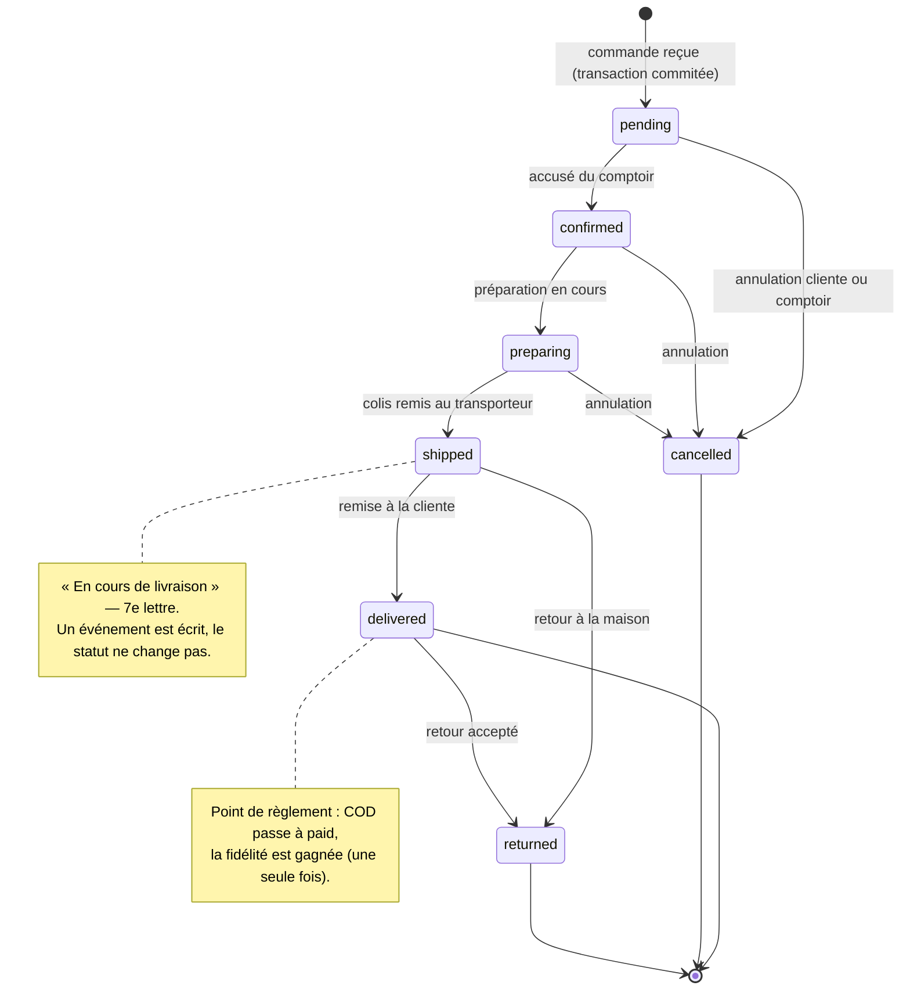

# Cléopâtre — Diagrammes UML globaux

> **Diagramme de cas d'utilisation global · Diagramme de séquence global · Diagramme de classes global**
>
> Boutique en ligne de la parapharmacie Cléopâtre (Ezzahra / Hammam-Lif, Tunisie) —
> Next.js 16 (App Router) · React 19 · TypeScript · Drizzle ORM · PostgreSQL 17 · Server Actions.
>
> Ces trois vues sont **dérivées du code**, pas d'une intention : chaque cas d'utilisation,
> chaque message et chaque classe renvoie à un fichier du dépôt. La traçabilité complète est
> donnée en [annexe A](#annexe-a--traçabilité-cas-dutilisation--code--tables).

---

## Sommaire

- [0. Comment lire ce document](#0-comment-lire-ce-document)
- [1. Diagramme de cas d'utilisation global](#1-diagramme-de-cas-dutilisation-global)
- [2. Diagramme de séquence global](#2-diagramme-de-séquence-global)
- [3. Diagramme de classes global](#3-diagramme-de-classes-global)
- [Annexe A — Traçabilité cas d'utilisation → code → tables](#annexe-a--traçabilité-cas-dutilisation--code--tables)
- [Annexe B — États d'une commande](#annexe-b--états-dune-commande)
- [Annexe C — Contraintes d'intégrité qui tiennent le modèle](#annexe-c--contraintes-dintégrité-qui-tiennent-le-modèle)
- [Annexe D — Vérifier et faire évoluer ces diagrammes](#annexe-d--vérifier-et-faire-évoluer-ces-diagrammes)

---

## 0. Comment lire ce document

### 0.1 Périmètre

Les trois diagrammes couvrent **l'ensemble du système** :

| Vue | Ce qu'elle montre | Échelle |
|---|---|---|
| Cas d'utilisation | qui se sert du système, et pour quoi faire | 6 acteurs · 60 cas · 7 modules |
| Séquence | le trajet complet d'une commande, de la recherche au service après-vente, puis la boucle quotidienne | 11 participants · 8 phases |
| Classes | le modèle de domaine réel (51 tables), les services métier et les énumérations | 49 classes persistantes · 17 énumérations · 17 services |

### 0.2 Sources (tout est vérifiable)

| Élément | Fichier |
|---|---|
| Modèle de données | `src/db/schema.ts` (51 tables, 17 énumérations, index partiels) |
| Façade applicative | `src/actions/*.ts` (8 modules, ~90 Server Actions) |
| Logique métier | `src/lib/*` (panier, promotions, lots, commande, fidélité, e-mails, support, tâches) |
| Routes et écrans | `src/app/(site)/*`, `src/app/admin/*`, `src/app/api/*` |
| Garde d'accès | `src/proxy.ts` (la porte : cookie de session avant tout rendu) |
| Exploitation | `docs/DEPLOYMENT.md`, `docs/PAYMENTS.md`, `README.md` |

### 0.3 Notation

Les diagrammes sont écrits en **Mermaid** (rendu natif par GitHub, VS Code, Obsidian,
mermaid.live). Mermaid ne possède pas le métamodèle UML complet ; les équivalences utilisées ici
sont les suivantes :

| Élément UML | Rendu retenu |
|---|---|
| Acteur | nœud sombre étiqueté, hors de la frontière du système |
| Cas d'utilisation | nœud « stade » (ellipse approchée) à l'intérieur du cadre système |
| `«include»` / `«extend»` | flèche pointillée étiquetée `«include»` / `«extend»` |
| Ligne de vie | `participant` du diagramme de séquence |
| Message synchrone / retour | `->>`  /  `-->>` |
| Fragment `alt` / `opt` / `loop` | mêmes mots-clés, syntaxe identique à UML |
| Classe | `class` ; stéréotypes `«énumération»`, `«service»` |
| Association, composition, dépendance | `-->`, `*--`, `..>` avec multiplicités `"1"`, `"0..*"` |

### 0.4 Trois règles de lecture

1. **Le serveur décide seul.** Tous les montants, remises, stocks et statuts sont recalculés côté
   serveur dans une transaction ; l'interface n'est jamais la source de vérité
   (`src/lib/payments.ts`, `src/actions/checkout.ts`).
2. **Les montants sont des entiers en millimes** (1 DT = 1 000 millimes) — jamais de flottants.
3. **Le stock réel est le lot**, pas la ligne produit : un lot porte un numéro, une date et un
   emplacement, et c'est le FEFO (*first expired, first out*) qui décide ce qui quitte le rayon
   (`src/lib/lots.ts`, `src/lib/orders.ts`).

---

## 1. Diagramme de cas d'utilisation global

### 1.1 Le diagramme

```mermaid
flowchart LR
  VIS["Visiteuse<br/>non connectée"]:::acteur
  CLI["Cliente<br/>rôle customer"]:::acteur
  SUP["Conseillère · pharmacienne<br/>rôle support"]:::acteur
  ADM["Administratrice<br/>rôle admin"]:::acteur
  CRN["Ordonnanceur<br/>cron quotidien"]:::systeme
  MAIL["Fournisseur e-mail<br/>Brevo · Resend"]:::systeme

  subgraph SYS["Système Cléopâtre — Espace Santé Beauté"]
    direction TB

    subgraph MOD1["Accès & identité"]
      UC01(["S'inscrire"])
      UC02(["Prouver son adresse<br/>code à 6 chiffres"])
      UC03(["Se connecter"])
      UC04(["Se déconnecter"])
      UC05(["Réinitialiser<br/>son mot de passe"])
      UC06(["Gérer profil<br/>et adresses"])
      UC07(["Exporter ou supprimer<br/>ses données"])
    end

    subgraph MOD2["Catalogue & découverte"]
      UC10(["Parcourir univers,<br/>rayons et besoins"])
      UC11(["Rechercher un produit"])
      UC12(["Consulter une fiche produit"])
      UC13(["Comparer des produits"])
      UC14(["Scanner un code-barres"])
      UC15(["Analyser une composition INCI"])
      UC16(["Vérifier un lot et sa date"])
      UC17(["Lire le journal et les guides"])
      UC18(["Trouver une boutique<br/>et ses horaires"])
    end

    subgraph MOD3["Panier & commande"]
      UC20(["Composer son panier"])
      UC21(["Valider un code promo"])
      UC22(["Passer commande"])
      UC23(["Choisir le mode de paiement"])
      UC24(["Régler par carte cadeau"])
      UC25(["Choisir le retrait en boutique"])
      UC26(["Suivre sa commande"])
      UC27(["Annuler sa commande"])
    end

    subgraph MOD4["Fidélité & engagement"]
      UC30(["Cumuler et échanger<br/>ses points (Club)"])
      UC31(["S'abonner à la lettre"])
      UC32(["Faire le diagnostic beauté"])
      UC33(["Construire une routine<br/>avec rappels"])
      UC34(["Tenir une liste de souhaits<br/>et la partager"])
      UC35(["Être alerté du<br/>réapprovisionnement"])
      UC36(["Programmer une recharge"])
      UC37(["Déposer un avis"])
      UC38(["Offrir une carte cadeau"])
    end

    subgraph MOD5["Après-vente & conciergerie"]
      UC40(["Ouvrir une demande d'aide"])
      UC41(["Dialoguer avec la conciergerie"])
      UC42(["Demander un retour (RMA)"])
      UC43(["Suivre ses retours"])
      UC44(["Noter la conversation"])
    end

    subgraph MOD6["Back-office — catalogue, stock, relation"]
      UC50(["Gérer le catalogue"])
      UC51(["Gérer les contenus éditoriaux"])
      UC52(["Gérer promotions et coupons"])
      UC53(["Modérer les avis"])
      UC55(["Réceptionner un lot"])
      UC56(["Dater, transférer, mettre en<br/>quarantaine ou déstocker"])
      UC57(["Ajuster le stock"])
      UC58(["Traiter les commandes"])
      UC59(["Saisir une commande manuelle"])
      UC60(["Encaisser, marquer payé, rembourser"])
      UC61(["Émettre ou annuler<br/>une carte cadeau"])
      UC65(["Répondre au support"])
      UC66(["Traiter les retours"])
      UC67(["Piloter les tâches (Admin OS)"])
      UC68(["Programmer des automatisations"])
      UC69(["Consulter analytique,<br/>recherches et audit"])
      UC70(["Gérer l'équipe et les rôles"])
      UC71(["Réexpédier les e-mails"])
    end

    subgraph MOD7["Services système"]
      UC80(["Envoyer les e-mails en attente"])
      UC81(["Boucle quotidienne"])
      UC82(["Notifier en temps réel"])
      UC83(["Recevoir les accusés de remise"])
    end
  end

  VIS --> UC01
  VIS --> UC03
  VIS --> UC05
  VIS --> UC10
  VIS --> UC11
  VIS --> UC12
  VIS --> UC13
  VIS --> UC14
  VIS --> UC15
  VIS --> UC16
  VIS --> UC17
  VIS --> UC18
  VIS --> UC20
  VIS --> UC21
  VIS --> UC22
  VIS --> UC31
  VIS --> UC35
  VIS --> UC38
  VIS --> UC40
  VIS --> UC41

  CLI --> UC02
  CLI --> UC04
  CLI --> UC06
  CLI --> UC07
  CLI --> UC23
  CLI --> UC24
  CLI --> UC25
  CLI --> UC26
  CLI --> UC27
  CLI --> UC30
  CLI --> UC32
  CLI --> UC33
  CLI --> UC34
  CLI --> UC36
  CLI --> UC37
  CLI --> UC42
  CLI --> UC43
  CLI --> UC44

  SUP --> UC41
  SUP --> UC58
  SUP --> UC60
  SUP --> UC65
  SUP --> UC66
  SUP --> UC67

  ADM --> UC50
  ADM --> UC51
  ADM --> UC52
  ADM --> UC53
  ADM --> UC55
  ADM --> UC56
  ADM --> UC57
  ADM --> UC59
  ADM --> UC61
  ADM --> UC67
  ADM --> UC68
  ADM --> UC69
  ADM --> UC70
  ADM --> UC71

  CRN --> UC80
  CRN --> UC81
  MAIL --> UC83

  UC01 -.->|"«include»"| UC02
  UC22 -.->|"«include»"| UC20
  UC22 -.->|"«include»"| UC23
  UC21 -.->|"«extend»"| UC22
  UC25 -.->|"«extend»"| UC22
  UC24 -.->|"«extend»"| UC23
  UC30 -.->|"«include»"| UC22
  UC27 -.->|"«extend»"| UC26
  UC37 -.->|"«include»"| UC03
  UC41 -.->|"«include»"| UC40
  UC42 -.->|"«include»"| UC40
  UC66 -.->|"«include»"| UC65
  UC55 -.->|"«include»"| UC57
  UC58 -.->|"«include»"| UC80
  UC58 -.->|"«include»"| UC82
  UC81 -.->|"«include»"| UC80

  classDef acteur fill:#1d1d1f,stroke:#1d1d1f,color:#f5f5f7
  classDef systeme fill:#e8e8ed,stroke:#1d1d1f,color:#1d1d1f
```



### 1.2 Les acteurs

| Acteur | Rôle technique | Ce qu'il peut faire | Garde d'accès |
|---|---|---|---|
| **Visiteuse** | session absente | consulter, chercher, composer un panier, commander sans compte, écrire à la conciergerie | aucune |
| **Cliente** | `users.role = "customer"` | tout ce qui précède + compte, commandes, retours, fidélité, abonnements, rituels, données personnelles | session + `emailVerifiedAt` pour l'espace privé |
| **Conseillère · pharmacienne** | `users.role = "support"` | support, conciergerie, retours, lecture et traitement des commandes, encaissement, tâches | `requireStaff()` |
| **Administratrice** | `users.role = "admin"` | tout le back-office : catalogue, stock, lots, promotions, équipe, automatisations, analytique | `requireAdmin()` |
| **Ordonnanceur** | appel `POST /api/cron/outbox` avec `CRON_SECRET` | boucle quotidienne : e-mails, rituels, abonnements, quarantaine des lots | jeton partagé **ou** session staff |
| **Fournisseur e-mail** | Brevo / Resend | reçoit les messages de la file, renvoie les accusés (délivré, ouvert, cliqué) | webhook signé |

### 1.3 Les cas d'utilisation, module par module

| Module | Cas | Écrans | Server Actions |
|---|---|---|---|
| Accès & identité | UC01–UC07 | `/inscription`, `/connexion`, `/mot-de-passe-oublie`, `/reinitialiser-mot-de-passe/[token]`, `/compte/verifie`, `/compte/profil`, `/consentements` | `register`, `verifyEmail`, `resendOtp`, `login`, `logout`, `updateProfile`, `changePassword`, `saveAddress`, `deleteAddress`, `forgotPassword`, `resetPassword`, `deleteAccount` |
| Catalogue & découverte | UC10–UC18 | `/`, `/univers/[slug]`, `/categorie/[slug]`, `/besoins`, `/besoin/[slug]`, `/boutique`, `/recherche`, `/produit/[slug]`, `/comparer`, `/scanner`, `/analyse-inci`, `/verifier-lot`, `/journal`, `/boutiques` | `logSearch`, `track` (la recherche lit `quickSearch`, `compare`, `barcode`, `inci`, `lots`) |
| Panier & commande | UC20–UC27 | `/panier`, `/commande`, `/commande/confirmation/[number]`, `/suivi`, `/compte/commandes` | `placeOrder`, `cancelOrder`, `validatePromo` |
| Fidélité & engagement | UC30–UC38 | `/programme-club`, `/compte/fidelite`, `/newsletter`, `/quiz`, `/routine-builder`, `/compte/rituels`, `/compte/favoris`, `/liste/[token]`, `/alertes-produit`, `/compte/abonnement`, `/carte-cadeau` | `saveDiagnostic`, `getRecommendations`, `saveRitual`, `createWishlistShare`, `subscribeRestock`, `createSubscription`, `submitReview`, `subscribeNewsletter`, `toggleWishlist` |
| Après-vente | UC40–UC44 | `/aide`, `/compte/support`, `/retours-rma`, `/compte/retours` | `createTicket`, `sendConciergeMessage`, `replyOwnTicket`, `getConciergeReplies`, `createReturnRequest` |
| Back-office | UC50–UC71 | `/admin/*` (49 écrans) | `admin.ts` + `admin-os.ts` + `lots.ts` (~50 actions) |
| Services système | UC80–UC83 | `/api/cron/outbox`, `/api/notifications/stream`, `/api/support/stream`, `/api/brevo/webhook` | `runDailyRound`, `flushOutbox`, `notify`, `track` |

### 1.4 Deux relations `«include»` qui expliquent l'architecture

- **UC42 « Demander un retour » `«include»` UC40 « Ouvrir une demande d'aide »** : un retour qui
  personne ne voit dans le support serait pire que pas de retour. La demande et son ticket sont
  écrits **dans la même transaction** (`src/actions/shop.ts`).
- **UC55 « Réceptionner un lot » `«include»` UC57 « Ajuster le stock »** : recevoir une boîte, c'est
  le moment où la date entre dans la maison et où le chiffre de stock doit bouger avec elle. Les
  deux écritures sont indissociables ; une boîte reçue déjà périmée part en quarantaine et
  **n'augmente pas** le stock vendable (`src/actions/lots.ts`).

---

## 2. Diagramme de séquence global

### 2.1 Le parcours complet, du premier clic à la boucle quotidienne

```mermaid
sequenceDiagram
  autonumber
  participant V as Visiteuse / Cliente
  participant UI as Interface Next.js (App Router)
  participant PX as proxy.ts (la porte)
  participant SA as Server Actions (actions/*)
  participant LB as Services métier (lib/*)
  participant DB as PostgreSQL 17 (Drizzle ORM)
  participant OB as File e-mail (email_outbox)
  participant MA as Fournisseur e-mail (Brevo)
  participant SS as Bus temps réel (SSE)
  participant BO as Back-office Cléopâtre
  participant CR as Cron quotidien

  rect rgb(245,245,247)
  Note over V,DB: Phase 1 — Découverte : les sept rayons, la recherche, le conseil
  V->>UI: ouvre l'accueil (film des sept univers) puis un univers
  UI->>LB: tunisClock() + shippingPromise(stock)
  LB-->>UI: « expédié aujourd'hui » si la commande part avant 14 h
  V->>UI: recherche « effaclar duo »
  UI->>SA: logSearch(requête, nb résultats, rupture)
  SA->>DB: INSERT search_events
  V->>UI: ouvre une fiche produit
  UI->>DB: produit, marque, rayons, avis publiés, actifs (INCI), lots datés
  UI->>LB: expiryState(lot) → état DLC, earliestExpiry()
  LB-->>UI: DLC la plus proche annonçable au comptoir
  end

  rect rgb(250,249,246)
  Note over V,DB: Phase 2 — Panier et prix (le client propose, le serveur décide)
  V->>UI: ajoute un produit
  UI->>UI: panier local (localStorage), 20 unités maximum par ligne
  UI->>LB: duoSavings(lignes) — affichage d'une économie « duo pharmacien »
  V->>UI: saisit un code promo
  UI->>SA: validatePromoAction(code, lignes)
  SA->>LB: evaluatePromo → règles, quota, ciblage rayon, dates
  LB->>DB: SELECT promotions (lecture seule, rien n'est consommé ici)
  LB-->>SA: remise / livraison offerte / motif de refus
  SA-->>UI: montant recalculé côté serveur
  end

  rect rgb(245,245,247)
  Note over V,DB: Phase 3 — Identification (ou commande en invitée)
  V->>PX: demande /compte ou /admin
  PX-->>V: sans cookie de session, redirection 307 vers /connexion
  alt Cliente déjà inscrite
  V->>SA: loginAction(e-mail, mot de passe)
  SA->>SA: checkOrigin() + rateLimit(login, 8 par minute)
  SA->>LB: verifyPassword(scrypt, sel + paramètres stockés)
  SA->>DB: UPDATE orders SET user_id … WHERE e-mail identique AND user_id IS NULL
  Note over SA,DB: les commandes invitées du même e-mail rejoignent enfin le compte
  SA->>DB: INSERT sessions (cookie cleo_session, httpOnly)
  alt adresse jamais prouvée
  SA-->>V: redirection /compte/verifie
  else adresse prouvée
  SA-->>V: redirection /compte (ou la page demandée)
  end
  else Nouvelle cliente
  V->>SA: registerAction(prénom, e-mail, mot de passe)
  SA->>DB: INSERT users (compte non vérifié) + INSERT sessions
  SA->>OB: lettre à code — six chiffres, 10 minutes, 5 essais
  SA-->>V: redirection /compte/verifie
  V->>SA: verifyEmailAction(code)
  SA->>LB: verifyOtp (5 échecs ou 10 minutes brûlent le code)
  SA->>DB: UPDATE users SET email_verified_at = now()
  SA->>OB: lettre de bienvenue (seulement à une adresse prouvée)
  end
  end

  rect rgb(240,240,237)
  Note over V,DB: Phase 4 — La commande : une seule transaction, tout ou rien
  V->>UI: « Passer commande » depuis /commande
  UI->>SA: placeOrderAction(charge Zod, clé d'idempotence)
  SA->>SA: checkOrigin() + rateLimit(checkout, 6 par 5 minutes)
  SA->>SA: isPaymentMethodEnabled(méthode) — card est refusée côté serveur
  SA->>DB: SELECT orders WHERE idempotency_key = ?
  Note over SA,DB: chemin rapide : un renvoi réseau retrouve la commande existante
  SA->>DB: BEGIN
  SA->>DB: SELECT pg_advisory_xact_lock(sha256(« cleo:idem: » + clé))
  Note over SA,DB: deux onglets simultanés se sérialisent ici — pas de doublon
  SA->>DB: lockProducts : SELECT … FOR UPDATE des produits du panier
  DB-->>SA: statut actif, stock réel, prix de référence (jamais ceux du client)
  opt code promo saisi
  SA->>DB: reservePromoUsage — verrou de ligne, quota contrôlé puis consommé
  end
  SA->>DB: remise « duo pharmacien » recalculée depuis la table duos (les deux produits requis)
  opt retrait en boutique
  SA->>DB: stores WHERE id = ? AND is_active — la boutique est revalidée
  end
  opt points de fidélité dépensés
  SA->>DB: SELECT users.loyalty_points FOR UPDATE (1 000 points = 10 DT)
  SA->>DB: INSERT loyalty_transactions (kind = redeem)
  end
  SA->>LB: shippingFor(sous-total, méthode) + GIFT_WRAP_FEE (5 DT)
  opt code carte cadeau
  SA->>DB: SELECT gift_cards FOR UPDATE, solde décrémenté, carte marquée consommée
  SA->>DB: UPDATE orders SET payment_status = 'paid' + événement de commande
  end
  SA->>LB: recordMovement(type = 'sale') pour chaque ligne
  LB->>DB: consumeLots → FEFO : DLC la plus proche, rayon avant réserve
  DB-->>LB: lots prélevés (n° + DLC) — refus si les lots ne couvrent pas la quantité
  SA->>DB: INSERT orders (numéro CL-AAAMMJJ-…, accessKey de 256 bits)
  SA->>DB: INSERT order_items (n° de lot et DLC gelés sur la ligne de facture)
  SA->>DB: INSERT order_events (« Commande reçue »)
  SA->>DB: COMMIT
  opt compte créé à la volée
  SA->>DB: INSERT users + INSERT sessions (la cliente est déjà connectée)
  end
  SA->>DB: INSERT analytics_events (order.placed)
  SA->>OB: mise en file de la lettre de commande
  SA-->>UI: numéro, accessKey, note éventuelle (« un compte existe déjà »)
  end

  rect rgb(250,249,246)
  Note over V,DB: Phase 5 — Confirmation, suivi, notifications
  V->>UI: /commande/confirmation/[number]
  UI->>DB: commande + pickupWindow(createdAt) pour le retrait en boutique
  Note over UI,DB: le numéro seul n'ouvre rien — accessKey ou session, sinon /suivi (numéro et e-mail)
  V->>UI: /suivi — numéro et adresse e-mail
  UI->>DB: commande, lignes, événements, créneau de retrait
  SS-->>UI: poussée « order » (notifications/stream, une file par onglet)
  end

  rect rgb(240,240,237)
  Note over V,MA: Phase 6 — Le comptoir : statuts, tournée, encaissement
  BO->>SA: updateOrderStatusAction(orderId, statut, message)
  SA->>DB: lockOrder + ALLOWED_TRANSITIONS[statut courant] contient le nouveau
  alt statut annulé ou retourné
  SA->>DB: restockOrder + retour aux lots + contre-écriture de la fidélité
  SA->>DB: si la commande était payée : payment_status = 'refunded'
  else statut livré
  SA->>DB: COD ⇒ payment_status = 'paid'
  SA->>DB: awardLoyaltyForOrder (idempotent : un seul gain par commande)
  end
  SA->>DB: UPDATE conditionnel au statut lu + INSERT order_events
  SA->>OB: lettre de statut, puis à la livraison la séquence de soin programmée
  SA->>SS: notification « order »
  BO->>SA: markOutForDeliveryAction — 7e lettre, le livreur est en tournée
  BO->>SA: saveOrderNotesAction (note interne + code de suivi transporteur)
  BO->>SA: setPaymentStatusAction / bulkOrderStatusAction (traitement par lot)
  end

  rect rgb(245,245,247)
  Note over V,MA: Phase 7 — Après-vente : retours, conciergerie, avis
  V->>SA: createReturnRequestAction(orderId, orderItemId, motif)
  SA->>DB: commande livrée + fenêtre de 7 jours depuis l'événement « delivered »
  SA->>DB: BEGIN … INSERT support_tickets + INSERT return_requests … COMMIT
  Note over SA,DB: index unique (order_item_id, user_id) : deux envois simultanés, un seul survit
  SA->>OB: lettre d'accusé de retour + notification « retours »
  BO->>SA: updateReturnStatusAction(id, statut, note)
  SA->>DB: UPDATE return_requests + INSERT ticket_messages
  SA->>SS: notification « retours »
  V->>SA: sendConciergeMessageAction(texte)
  SA->>DB: INSERT support_tickets (nouveau fil) puis INSERT ticket_messages
  alt dans les heures d'ouverture — lundi à samedi, 9 h-20 h (Africa/Tunis)
  SA->>SS: routage vers l'équipe (support/stream, filtré par rôle)
  else hors horaires
  SA->>DB: INSERT ticket_messages (is_bot = true) — « Le veilleur de nuit »
  end
  BO->>SA: staffSend, assignTicket, setTicketStatus, rateTicket
  V->>SA: submitReviewAction(note, titre, texte)
  SA->>DB: INSERT reviews (status = 'pending')
  BO->>SA: moderateReviewAction / verifyReviewAction
  SA->>DB: UPDATE reviews SET status = 'approved' + réponse de la maison
  SA->>SS: notification « review »
  end

  rect rgb(240,240,237)
  Note over CR,MA: Phase 8 — La boucle quotidienne (personne n'a besoin de regarder)
  CR->>SA: POST /api/cron/outbox (Bearer CRON_SECRET ou session staff)
  SA->>LB: runDailyRound()
  LB->>DB: flushOutbox(40) — la file part chez le fournisseur
  LB->>DB: dueRituals(date, heure, jour) — rappels de routine
  LB->>DB: runDueSubscriptions(date) — commandes de recharge, avantage abonnée de 5 %
  LB->>DB: quarantineOverdue() — tout lot à DLC atteinte quitte la vente, lot_events écrit
  LB->>DB: purge des jetons de réinitialisation expirés
  LB->>SS: notifications « subscription » et « loyalty » aux clientes concernées
  MA-->>SA: webhook /api/brevo/webhook — délivré, ouvert, cliqué
  SA->>DB: UPDATE email_outbox (état réel du courrier)
  end
```



### 2.2 Les participants

| Participant | Nature | Fichier(s) |
|---|---|---|
| Visiteuse / Cliente | acteur humain | navigateur |
| Interface Next.js | rendu serveur React 19, App Router | `src/app/(site)/**` |
| `proxy.ts` — la porte | garde de rendu : cookie de session avant tout affichage | `src/proxy.ts` |
| Server Actions | façade applicative : Zod, origine, limitation de débit | `src/actions/*.ts` |
| Services métier | règles pures et transactions : lots, fidélité, promotions, e-mails | `src/lib/*` |
| PostgreSQL 17 | source unique de vérité | `src/db/schema.ts` |
| File e-mail | registre d'envoi : rien ne se perd, tout se rejoue | `email_outbox` |
| Fournisseur e-mail | Brevo / Resend + webhooks d'état | `src/lib/email/brevo.ts` |
| Bus temps réel | Server-Sent Events, un flux par onglet | `api/notifications/stream`, `api/support/stream` |
| Back-office | support et administration | `src/app/admin/**` |
| Cron quotidien | ordonnanceur externe | `api/cron/outbox` |

### 2.3 Les règles que la séquence applique

| Règle | Où elle vit |
|---|---|
| Toute action sensible vérifie l'origine, puis le débit (6 commandes / 5 min, 8 connexions / min, 20 messages / 10 min…) | `src/lib/origin.ts`, `src/lib/rate-limit.ts` |
| Une commande ne s'écrit jamais deux fois : verrou consultatif + index unique sur la clé d'idempotence | `src/actions/checkout.ts` |
| Les prix, remises, frais et stocks sont relus sous verrou ; le panier n'est qu'une proposition | `lockProducts`, `reservePromoUsage` |
| Le stock réel est le lot : FEFO, et refus de vendre ce qu'on ne peut pas justifier | `src/lib/lots.ts`, `recordMovement` |
| La fidélité se gagne à la livraison, jamais à la commande, et se reprise en cas de retour | `awardLoyaltyForOrder`, `reverseLoyaltyForOrder` |
| Les lettres partent **après** le commit, jamais pendant | `src/lib/email/send.ts` |
| Un retour écrit toujours son ticket, dans la même transaction | `src/actions/shop.ts` |
| Hors heures d'ouverture, la conciergerie répond par un bot nommé, puis l'humain reprend la main | `src/actions/experience.ts` |
| La marchandise périmée sort la nuit, même si personne ne regarde | `quarantineOverdue()`, `runDailyRound()` |

---

## 3. Diagramme de classes global

### 3.1 Le diagramme

> **49 classes persistantes** représentent les **51 tables** : les deux tables de liaison
> (`product_concerns`, `article_products`) sont modélisées en associations `"0..*" -- "0..*"`,
> qui est exactement ce qu'elles sont. Les 17 énumérations PostgreSQL sont des `«enumeration»`,
> et les services de `src/lib` portent les opérations que les entités n'ont pas : ici, la règle
> métier vit dans le service, pas dans la ligne.

```mermaid
classDiagram
  direction TB

  namespace P1_Acces_et_identite {
    class User {
      +int id
      +string email
      +string passwordHash
      +string firstName
      +string lastName
      +string phone
      +UserRole role
      +int loyaltyPoints
      +string locale
      +timestamp birthDate
      +bool emailOptIn
      +timestamp emailVerifiedAt
    }
    class Session {
      +string id
      +int userId
      +timestamp expiresAt
      +text userAgent
    }
    class PasswordReset {
      +string tokenHash
      +int userId
      +timestamp expiresAt
      +timestamp usedAt
    }
    class EmailOtp {
      +int id
      +int userId
      +string codeHash
      +string purpose
      +timestamp expiresAt
      +timestamp consumedAt
      +int failedAttempts
    }
    class Address {
      +int id
      +int userId
      +string label
      +string fullName
      +string phone
      +string line1
      +string line2
      +string city
      +string governorate
      +string postalCode
      +bool isDefault
    }
  }

  namespace P2_Catalogue {
    class Brand {
      +int id
      +string slug
      +string name
      +string country
      +text story
      +bool isFeatured
      +jsonb heroProductIds
    }
    class Category {
      +int id
      +string slug
      +string name
      +text description
      +text story
      +bool isUniverse
      +int parentId
      +int sortOrder
    }
    class Concern {
      +int id
      +string slug
      +string name
      +text intro
    }
    class Product {
      +int id
      +string slug
      +string sku
      +string name
      +int brandId
      +int categoryId
      +int universeId
      +Millimes priceMillimes
      +Millimes compareAtMillimes
      +int stock
      +int lowStockThreshold
      +ProductStatus status
      +bool isFeatured
      +jsonb keyActives
      +int ratingAvg
      +int ratingCount
      +int salesCount
    }
    class Shelf {
      +int id
      +jsonb title
      +jsonb subtitle
      +int startMonth
      +int endMonth
      +jsonb productIds
      +bool isActive
    }
    class Duo {
      +int id
      +string slug
      +jsonb name
      +int productIdA
      +int productIdB
      +Millimes discountMillimes
      +bool isActive
    }
    class RoutineStep {
      +int id
      +int concernId
      +int position
      +int productId
      +jsonb label
      +jsonb reason
    }
    class ProductSubstitute {
      +int id
      +int productId
      +int substituteProductId
      +jsonb reason
      +int position
    }
    class ProductPair {
      +int id
      +int productId
      +int pairProductId
      +string reason
      +int position
    }
    class Review {
      +int id
      +int productId
      +int userId
      +string authorName
      +int rating
      +string title
      +text body
      +ReviewStatus status
      +text reply
      +bool isVerified
    }
    class Article {
      +int id
      +string slug
      +string title
      +string excerpt
      +text body
      +string tag
      +string author
      +string authorRole
      +int readMinutes
      +bool isPublished
      +timestamp publishedAt
    }
  }

  namespace P3_Stock_et_comptoir {
    class Store {
      +int id
      +string slug
      +string name
      +string address
      +string city
      +string phone
      +string hours
      +string mapsUrl
      +bool isActive
    }
    class ProductLot {
      +int id
      +int productId
      +int storeId
      +string lot
      +timestamp expiresAt
      +int quantity
      +string placed
      +string supplier
      +timestamp receivedAt
      +LotStatus status
      +int clearancePercent
      +text note
    }
    class LotEvent {
      +int id
      +int lotId
      +LotEventType type
      +int quantity
      +text note
      +int orderId
      +int userId
    }
    class InventoryMovement {
      +int id
      +int productId
      +MovementType type
      +int quantity
      +int stockAfter
      +string reason
      +int orderId
      +int userId
    }
  }

  namespace P4_Commande_et_prix {
    class Order {
      +int id
      +string number
      +string idempotencyKey
      +string accessKey
      +int userId
      +string email
      +string phone
      +OrderStatus status
      +PaymentMethod paymentMethod
      +PaymentStatus paymentStatus
      +ShippingMethod shippingMethod
      +jsonb shippingAddress
      +int storeId
      +Millimes subtotalMillimes
      +Millimes discountMillimes
      +Millimes shippingMillimes
      +Millimes giftWrapMillimes
      +Millimes totalMillimes
      +string promoCode
      +string trackingCode
      +int loyaltyEarned
      +int loyaltySpent
    }
    class OrderItem {
      +int id
      +int orderId
      +int productId
      +string name
      +string sku
      +string brandName
      +Millimes unitPriceMillimes
      +int quantity
      +Millimes lineTotalMillimes
      +string lotNumber
      +timestamp lotExpiresAt
    }
    class OrderEvent {
      +int id
      +int orderId
      +OrderStatus status
      +string message
      +int actorId
      +timestamp createdAt
    }
    class Promotion {
      +int id
      +string code
      +string label
      +PromoType type
      +int value
      +Millimes minSubtotalMillimes
      +Millimes maxDiscountMillimes
      +int universeId
      +int usageLimit
      +int usageCount
      +int perUserLimit
      +timestamp startsAt
      +timestamp endsAt
      +bool isActive
    }
    class GiftCard {
      +int id
      +string codeHash
      +string codePrefix
      +Millimes initialMillimes
      +Millimes balanceMillimes
      +string status
      +timestamp expiresAt
      +int issuedBy
      +string note
    }
    class GiftCardTransaction {
      +int id
      +int giftCardId
      +int orderId
      +Millimes amountMillimes
      +string kind
      +string reason
    }
  }

  namespace P5_Engagement_client {
    class WishlistItem {
      +int userId
      +int productId
      +string note
    }
    class WishlistShare {
      +int id
      +int userId
      +string token
      +string label
      +string message
      +timestamp revokedAt
    }
    class Diagnostic {
      +int id
      +int userId
      +jsonb answers
      +jsonb productIds
    }
    class Ritual {
      +int id
      +int userId
      +string name
      +string moment
      +string season
      +jsonb items
      +bool reminderEnabled
      +int reminderHour
      +int reminderDays
      +string lastRemindedOn
    }
    class RestockAlert {
      +int id
      +int productId
      +int userId
      +string email
      +string channel
      +string locale
      +timestamp notifiedAt
    }
    class Subscription {
      +int id
      +int userId
      +string status
      +int frequencyDays
      +timestamp nextDueAt
    }
    class SubscriptionItem {
      +int id
      +int subscriptionId
      +int productId
      +int quantity
    }
    class SubscriptionEvent {
      +int id
      +int subscriptionId
      +string type
      +string detail
      +int orderId
    }
    class LoyaltyTransaction {
      +int id
      +int userId
      +int points
      +string reason
      +string kind
      +int orderId
    }
    class Notification {
      +int id
      +int userId
      +string category
      +string title
      +string body
      +string href
      +string priority
      +string dedupeKey
      +timestamp readAt
    }
    class NewsletterSubscriber {
      +int id
      +string email
    }
  }

  namespace P6_Apres_vente_et_support {
    class SupportTicket {
      +int id
      +int userId
      +string email
      +string name
      +TicketType type
      +TicketPriority priority
      +string subject
      +text message
      +TicketStatus status
      +string orderNumber
      +int orderId
      +int assignedSupportId
      +timestamp lastMessageAt
      +timestamp resolvedAt
      +int rating
    }
    class TicketMessage {
      +int id
      +int ticketId
      +int userId
      +string authorName
      +text body
      +bool isBot
      +string kind
      +int senderId
      +jsonb attachment
      +timestamp readAt
    }
    class ReturnRequest {
      +int id
      +string number
      +int userId
      +int orderId
      +int orderItemId
      +string reason
      +text message
      +ReturnStatus status
      +text staffNote
      +timestamp resolvedAt
      +int resolvedBy
      +int ticketId
    }
  }

  namespace P7_Exploitation_et_pilotage {
    class AdminTask {
      +int id
      +string title
      +text detail
      +TaskPriority priority
      +TaskStatus status
      +string source
      +string entity
      +string entityId
      +string href
      +int assigneeId
      +int createdById
      +timestamp dueAt
      +timestamp closedAt
    }
    class Automation {
      +int id
      +string name
      +string description
      +string trigger
      +jsonb conditions
      +jsonb actions
      +bool isActive
      +int runCount
      +timestamp lastRunAt
      +int createdById
    }
    class AutomationRun {
      +int id
      +int automationId
      +string mode
      +int matched
      +int affected
      +string status
      +text detail
    }
    class AuditLog {
      +int id
      +int actorId
      +string action
      +string entity
      +string entityId
      +jsonb details
    }
    class EmailOutbox {
      +int id
      +string kind
      +string to
      +int userId
      +string locale
      +string subject
      +jsonb payload
      +timestamp sendAt
      +timestamp sentAt
      +string status
      +int attempts
      +string providerMessageId
      +timestamp deliveredAt
      +timestamp openedAt
      +timestamp clickedAt
      +jsonb webhookEvents
    }
    class SearchEvent {
      +int id
      +string query
      +int resultsCount
      +bool outOfStock
      +int userId
    }
    class QueryLanding {
      +int id
      +string query
      +string label
      +string href
      +string kind
    }
    class AnalyticsEvent {
      +int id
      +string name
      +jsonb payload
      +int userId
    }
    class RateLimit {
      +string key
      +int count
      +timestamp resetAt
    }
  }

  namespace Services_metier {
    class AuthService {
      <<service>>
      +hashPassword(password) string
      +verifyPassword(password, hash) bool
      +createSession(userId, userAgent)
      +getCurrentUser() SafeUser
      +requireUser() requireStaff() requireAdmin()
      +destroySession()
    }
    class CartService {
      <<service>>
      +addLine(line) CartLine
      +duoSavings(lines) Duo[]
      +persist(localStorage)
    }
    class CatalogService {
      <<service>>
      +quickSearch(query, limit)
      +search(filters)
      +compare(ids)
      +barcodeLookup(code)
      +inciParse(text)
    }
    class PromotionEngine {
      <<service>>
      +evaluatePromo(code, lines, userId, email)
      +reservePromoUsage(tx, code, lines, userId, email)
      +countUserUses(userId, email, code)
    }
    class LotStockService {
      <<service>>
      +chooseLots(lots, quantity, now) picks, short
      +isSellable(lot, now) bool
      +expiryState(expiresAt, now) ExpiryState
      +receiveLot(tx, lot)
      +consumeLots(tx, args)
      +returnToLots(tx, args)
      +quarantineOverdue() report
    }
    class OrderLifecycleService {
      <<service>>
      +reserveOrderNumber(tx) string
      +generateAccessKey() string
      +lockOrder(tx, id) Order
      +lockProducts(tx, ids) Product[]
      +recordMovement(tx, args) stock, lots
      +addOrderEvent(tx, orderId, status, message)
      +restockOrder(tx, orderId, actorId)
      +awardLoyaltyForOrder(tx, order) int
      +reverseLoyaltyForOrder(tx, order, reason) int
      +restoreSpentLoyalty(tx, order) int
      +ALLOWED_TRANSITIONS
    }
    class LoyaltyLedger {
      <<service>>
      +getVipSummary(userId) LoyaltySummary
      +loyaltyPointsFor(total) int
      +loyaltyDiscountFor(points) Millimes
    }
    class GiftCardService {
      <<service>>
      +generateGiftCardCode() string
      +hashGiftCardCode(code) string
      +issueGiftCard(input)
      +redeemGiftCardForOrder(tx, args)
      +cancelGiftCard(id)
      +balance(code)
    }
    class ReturnPolicy {
      <<service>>
      +returnWindow(deliveredAt, now) ReturnWindow
      +RETURN_WINDOW_DAYS
    }
    class FulfilmentPolicy {
      <<service>>
      +tunisClock(now) hour, minute, weekday
      +shippingPromise(stock, hour, weekday) ShipPromise
      +pickupWindow(now) readyAt, holdUntil
      +CUTOFF_HOUR
    }
    class PaymentPolicy {
      <<service>>
      +enabledPaymentMethods() PaymentMethod[]
      +isPaymentMethodEnabled(method) bool
    }
    class NotificationService {
      <<service>>
      +notify(input) Notification
      +listNotifications(args)
      +unreadNotificationCount(userId) int
      +unreadCountByCategory(userId)
      +markNotificationRead(userId, id) bool
      +markAllNotificationsRead(userId, category) int
    }
    class EmailService {
      <<service>>
      +sendOrQueueEmail(args)
      +flushOutbox(limit) int
      +sendOrderStatusEmail(order, kind)
      +queueCareSequence(order)
      +enqueueRestockAlerts(productId)
    }
    class SupportChatService {
      <<service>>
      +customerSend(args)
      +staffSend(args)
      +markRead(args) markTyping(args)
      +assignTicket(args) setTicketStatus(args)
      +setPriority(args) rateTicket(args)
      +visibleTicket(user, id)
    }
    class AutomationEngine {
      <<service>>
      +AUTOMATION_TRIGGERS
      +triggerDef(key)
      +evaluate(triggerKey, conditions) Evaluation
      +runAutomation(id, mode, actor)
      +runScheduledAutomations()
    }
    class DailyRound {
      <<service>>
      +runDailyRound() DailyReport
      +dueRituals(date, hour, weekday)
      +runDueSubscriptions(date)
    }
    class TelemetryService {
      <<service>>
      +track(name, payload, userId)
      +audit(actorId, action, entity, entityId, details)
      +logSearch(query, resultsCount, outOfStock)
    }
  }

  namespace Enumerations {
    class UserRole {
      <<enumeration>>
      customer
      support
      admin
    }
    class ProductStatus {
      <<enumeration>>
      draft
      active
      archived
    }
    class OrderStatus {
      <<enumeration>>
      pending
      confirmed
      preparing
      shipped
      delivered
      cancelled
      returned
    }
    class PaymentMethod {
      <<enumeration>>
      cod
      bank_transfer
      card
      gift_card
    }
    class PaymentStatus {
      <<enumeration>>
      pending
      paid
      refunded
      failed
    }
    class ShippingMethod {
      <<enumeration>>
      standard
      express
      pickup
    }
    class PromoType {
      <<enumeration>>
      percent
      fixed
      free_shipping
    }
    class ReviewStatus {
      <<enumeration>>
      pending
      approved
      rejected
    }
    class MovementType {
      <<enumeration>>
      in
      out
      adjust
      sale
      restock
      return
    }
    class LotStatus {
      <<enumeration>>
      sale
      quarantine
      destroyed
      returned
    }
    class LotEventType {
      <<enumeration>>
      received
      sold
      returned
      moved
      quarantined
      destroyed
      adjusted
      dated
    }
    class TicketStatus {
      <<enumeration>>
      open
      answered
      in_progress
      resolved
      closed
    }
    class TicketType {
      <<enumeration>>
      product_question
      return_request
      exchange
      order
      delivery
      damaged_product
      complaint
      pharmacist_advice
      other
    }
    class TicketPriority {
      <<enumeration>>
      low
      normal
      high
      urgent
    }
    class ReturnStatus {
      <<enumeration>>
      pending
      in_review
      awaiting_customer
      approved
      rejected
      completed
    }
    class TaskPriority {
      <<enumeration>>
      critical
      high
      normal
      low
    }
    class TaskStatus {
      <<enumeration>>
      open
      in_progress
      blocked
      done
      dismissed
    }
  }

  %% ── Identité ───────────────────────────────────────────────────────────
  User "1" --> "0..*" Session : ouvre
  User "1" --> "0..*" PasswordReset : demande
  User "1" --> "0..*" EmailOtp : prouve son adresse
  User "1" --> "0..*" Address : enregistre
  User "1" --> "0..*" Order : passe
  User "1" --> "0..*" Review : écrit
  User "1" --> "0..*" WishlistItem : souhaite
  User "1" --> "0..*" WishlistShare : partage
  User "1" --> "0..*" Diagnostic : complète
  User "1" --> "0..*" Ritual : compose
  User "1" --> "0..*" RestockAlert : surveille
  User "1" --> "0..*" Subscription : programme
  User "1" --> "0..*" LoyaltyTransaction : cumule
  User "1" --> "0..*" Notification : reçoit
  User "1" --> "0..*" SupportTicket : ouvre
  User "1" --> "0..*" ReturnRequest : demande
  User "1" --> "0..*" GiftCard : émet
  User "1" --> "0..*" AdminTask : se voit confier
  User "1" --> "0..*" Automation : crée
  User "1" --> "0..*" AuditLog : signe

  %% ── Catalogue ──────────────────────────────────────────────────────────
  Brand "1" --> "0..*" Product : signe
  Category "1" --> "0..*" Product : classe
  Category "0..1" --> "0..*" Product : univers
  Category "0..1" --> "0..*" Category : parent
  Category "0..1" --> "0..*" Promotion : cible
  Product "0..*" -- "0..*" Concern : product_concerns
  Product "1" --> "0..*" Review : reçoit
  Duo "1" --> "1" Product : produitA
  Duo "1" --> "1" Product : produitB
  RoutineStep "0..*" --> "0..1" Concern : étape de
  RoutineStep "0..*" --> "1" Product : prescrit
  ProductSubstitute "0..*" --> "1" Product : remplace
  ProductSubstitute "0..*" --> "1" Product : remplacé par
  ProductPair "0..*" --> "1" Product : s'associe à
  Article "0..*" -- "0..*" Product : article_products
  Shelf "0..*" -- "0..*" Product : met en avant

  %% ── Stock & comptoir ───────────────────────────────────────────────────
  Store "1" --> "0..*" ProductLot : range
  Product "1" --> "0..*" ProductLot : découpé en
  ProductLot "1" *-- "0..*" LotEvent : journalise
  Product "1" --> "0..*" InventoryMovement : bouge
  Order "0..1" --> "0..*" LotEvent : explique
  Order "0..1" --> "0..*" InventoryMovement : origine
  Order "0..1" --> "0..*" ProductLot : consomme

  %% ── Commande & prix ────────────────────────────────────────────────────
  Order "1" *-- "1..*" OrderItem : contient
  Order "1" *-- "0..*" OrderEvent : raconte
  Product "0..1" --> "0..*" OrderItem : référence
  Order "0..1" --> "0..1" Store : retirée à
  OrderItem "0..1" --> "0..1" ReturnRequest : retournée par
  GiftCard "1" *-- "0..*" GiftCardTransaction : mouvemente
  GiftCardTransaction "0..*" --> "0..1" Order : règle
  LoyaltyTransaction "0..*" --> "0..1" Order : s'impute à

  %% ── Engagement ─────────────────────────────────────────────────────────
  Product "1" --> "0..*" WishlistItem : est souhaité
  Product "1" --> "0..*" RestockAlert : est surveillé
  Subscription "1" *-- "1..*" SubscriptionItem : contient
  Subscription "1" *-- "0..*" SubscriptionEvent : journalise
  Product "1" --> "0..*" SubscriptionItem : rechargé
  Order "0..1" --> "0..*" SubscriptionEvent : déclenche

  %% ── Après-vente ────────────────────────────────────────────────────────
  SupportTicket "1" *-- "0..*" TicketMessage : contient
  SupportTicket "0..1" --> "0..1" Order : concerne
  ReturnRequest "0..1" --> "0..1" SupportTicket : s'appuie sur
  User "0..1" --> "0..*" SupportTicket : est assigné à

  %% ── Exploitation ───────────────────────────────────────────────────────
  Automation "1" *-- "0..*" AutomationRun : exécute

  %% ── Dépendances des services ───────────────────────────────────────────
  AuthService ..> User : identifie
  CartService ..> Product : compose
  CatalogService ..> Product : interroge
  PromotionEngine ..> Promotion : évalue
  LotStockService ..> ProductLot : FEFO
  OrderLifecycleService ..> Order : écrit
  OrderLifecycleService ..> ProductLot : consomme
  LoyaltyLedger ..> LoyaltyTransaction : lit
  GiftCardService ..> GiftCard : émet
  ReturnPolicy ..> ReturnRequest : encadre
  FulfilmentPolicy ..> Store : promet
  NotificationService ..> Notification : publie
  EmailService ..> EmailOutbox : met en file
  SupportChatService ..> SupportTicket : fait vivre
  AutomationEngine ..> Automation : exécute
  DailyRound ..> EmailOutbox : vide la file
  TelemetryService ..> AuditLog : trace
```

### 3.2 Les paquets du modèle

| Paquet | Rôle | Tables |
|---|---|---|
| **Identité** | comptes, sessions, adresses, preuve d'adresse | `users`, `sessions`, `password_resets`, `email_otps`, `addresses` |
| **Catalogue** | ce que la maison vend et comment elle le range | `brands`, `categories`, `concerns`, `products`, `product_concerns`, `shelves`, `duos`, `routine_steps`, `product_substitutes`, `product_pairs`, `reviews`, `articles`, `article_products` |
| **Stock & comptoir** | la marchandise réelle : lots, dates, emplacements, mouvements | `stores`, `product_lots`, `lot_events`, `inventory_movements` |
| **Commande & prix** | la vente, son journal et la valeur stockée | `orders`, `order_items`, `order_events`, `promotions`, `gift_cards`, `gift_card_transactions` |
| **Engagement client** | fidélité, rituels, listes, abonnements, alertes | `wishlist_items`, `wishlist_shares`, `diagnostics`, `rituals`, `restock_alerts`, `subscriptions`, `subscription_items`, `subscription_events`, `loyalty_transactions`, `notifications`, `newsletter_subscribers` |
| **Après-vente & support** | la parole de la cliente et ce qu'on en fait | `support_tickets`, `ticket_messages`, `return_requests` |
| **Exploitation & pilotage** | le travail de la maison, la preuve et la mesure | `admin_tasks`, `automations`, `automation_runs`, `audit_logs`, `email_outbox`, `search_events`, `query_landings`, `analytics_events`, `rate_limits` |
| **Services métier** | les règles et les transactions (non persistants) | `src/lib/*` |

### 3.3 Les énumérations, et ce qu'elles veulent dire

| Énumération | Valeurs | Lecture |
|---|---|---|
| `UserRole` | customer · support · admin | trois métiers, trois portes (`requireUser`, `requireStaff`, `requireAdmin`) |
| `ProductStatus` | draft · active · archived | seule une fiche `active` peut être vendue |
| `OrderStatus` | pending · confirmed · preparing · shipped · delivered · cancelled · returned | la vie de la commande — voir annexe B |
| `PaymentMethod` | cod · bank_transfer · card · gift_card | `card` existe en base mais est **refusée par le serveur** : aucune intégration |
| `PaymentStatus` | pending · paid · refunded · failed | COD passe à `paid` à la livraison |
| `ShippingMethod` | standard · express · pickup | pickup = retrait boutique, validé sur `stores` |
| `PromoType` | percent · fixed · free_shipping | évalué par le moteur pur `promotions-math.ts` |
| `ReviewStatus` | pending · approved · rejected | rien ne se publie sans modération |
| `MovementType` | in · out · adjust · sale · restock · return | chaque mouvement écrit le stock après coup (`stock_after`) |
| `LotStatus` | sale · quarantine · destroyed · returned | **seul `sale` est prélevé par le FEFO** |
| `LotEventType` | received · sold · returned · moved · quarantined · destroyed · adjusted · dated | un stock qui bouge sans événement est un stock que personne ne peut expliquer |
| `TicketStatus` | open · answered · in_progress · resolved · closed | `answered` est hérité, migré en `in_progress` |
| `TicketType` | product_question · return_request · exchange · order · delivery · damaged_product · complaint · pharmacist_advice · other | oriente le routage du support |
| `TicketPriority` | low · normal · high · urgent | `urgent` remonte dans `/admin/attention` |
| `ReturnStatus` | pending · in_review · awaiting_customer · approved · rejected · completed | suivi du RMA |
| `TaskPriority` | critical · high · normal · low | Admin OS |
| `TaskStatus` | open · in_progress · blocked · done · dismissed | une tâche est une décision due à quelqu'un |

### 3.4 Quatre choix de modélisation à connaître

1. **Les tables de liaison sont des associations.** `product_concerns` et `article_products` n'ont
   pas d'identité propre : ce sont des associations `"0..*" -- "0..*"`, représentées comme telles.
2. **Certains liens ne sont pas des clés étrangères** — et c'est volontaire :
   `orders.store_id`, `order_events.actor_id`, `inventory_movements.order_id`,
   `search_events.user_id`, `analytics_events.user_id`, `categories.parent_id`. Le schéma préfère
   garder l'historique quand l'objet disparaît (une commande supprimée ne doit pas effacer la trace
   du mouvement de stock qui l'a servie). Ces liens sont modélisés en associations `"0..1" -->`
   avec multiplicité, non en composition.
3. **Le stock vit deux fois, exprès.** `products.stock` est le total que lit tout le monde ;
   `product_lots` dit d'où il vient et jusqu'à quand il vaut. Les deux ne peuvent pas diverger :
   le mouvement de lot et la mise à jour du total s'écrivent dans la même transaction
   (`recordMovement`).
4. **`card` est dans l'énumération mais pas dans la politique.** Le schéma peut stocker une valeur
   que le serveur refuse : c'est `PaymentPolicy` (`src/lib/payments.ts`) qui décide, pas la base.

---

## Annexe A — Traçabilité cas d'utilisation → code → tables

| Cas | Écran / route | Server Action ou service | Tables |
|---|---|---|---|
| UC01 · UC02 | `/inscription`, `/compte/verifie` | `registerAction`, `verifyEmailAction`, `resendOtpAction`, `sendOtpEmail`, `verifyOtp` | `users`, `sessions`, `email_otps`, `email_outbox` |
| UC03 | `/connexion` | `loginAction` (rattache les commandes invitées) | `users`, `sessions`, `orders` |
| UC04 | — | `logoutAction` | `sessions` |
| UC05 | `/mot-de-passe-oublie`, `/reinitialiser-mot-de-passe/[token]` | `forgotPasswordAction`, `resetPasswordAction` | `password_resets`, `users`, `sessions` |
| UC06 · UC07 | `/compte/profil`, `/compte`, `/consentements`, `api/compte/export` | `updateProfileAction`, `changePasswordAction`, `saveAddressAction`, `deleteAddressAction`, `deleteAccountAction`, `setEmailOptInAction`, `saveBirthDateAction` | `users`, `addresses`, `sessions` |
| UC10 | `/univers/[slug]`, `/categorie/[slug]`, `/besoins`, `/collections` | lecture + `next-feature-queries` | `categories`, `concerns`, `shelves`, `products` |
| UC11 | `/recherche`, `api/search`, `api/search/trending` | `logSearchAction`, `quickSearch` | `search_events`, `query_landings`, `products` |
| UC12 | `/produit/[slug]` | `shippingPromise`, `expiryState`, `earliestExpiry` | `products`, `brands`, `reviews`, `product_lots` |
| UC13 · UC14 · UC15 · UC16 | `/comparer`, `/scanner`, `/analyse-inci`, `/verifier-lot` | `compare`, `barcode`, `inci`, `lots` | `products`, `product_lots`, `lot_events` |
| UC17 · UC18 | `/journal`, `/editorial`, `/boutiques` | lecture | `articles`, `article_products`, `stores` |
| UC20 | `/panier` | `CartProvider` (localStorage), `duoSavings` | — (panier local, le serveur revalide tout) |
| UC21 | `/panier` | `validatePromoAction`, `evaluatePromo` | `promotions` |
| UC22 | `/commande` | `placeOrderAction` | `orders`, `order_items`, `order_events`, `products`, `product_lots`, `lot_events`, `inventory_movements`, `promotions`, `loyalty_transactions`, `users`, `sessions`, `analytics_events` |
| UC23 | `/commande` | `isPaymentMethodEnabled` (carte refusée) | `orders.payment_method`, `orders.payment_status` |
| UC24 | `/carte-cadeau`, `api/gift-cards/balance` | `redeemGiftCardForOrder`, `issueGiftCardAction`, `cancelGiftCardAction` | `gift_cards`, `gift_card_transactions`, `orders` |
| UC25 | `/commande`, `/reservation-boutique`, `/rendez-vous-retrait` | `pickupWindow`, validation `stores.is_active` | `stores`, `orders` |
| UC26 | `/suivi`, `/compte/commandes` | numéro + e-mail, ou `accessKey` | `orders`, `order_items`, `order_events` |
| UC27 | `/compte/commandes` | `cancelOrderAction` | `orders`, `order_events`, `inventory_movements`, `product_lots`, `loyalty_transactions` |
| UC30 | `/programme-club`, `/compte/fidelite` | `getVipSummary`, `loyaltyPointsFor`, `loyaltyDiscountFor` | `loyalty_transactions`, `users`, `orders` |
| UC31 | `/newsletter` | `subscribeNewsletterAction` | `newsletter_subscribers` |
| UC32 | `/quiz`, `/diagnostic` | `saveDiagnosticAction`, `getRecommendationsAction` | `diagnostics`, `products` |
| UC33 | `/routine-builder`, `/compte/rituels`, `/rappels` | `saveRitualAction`, `deleteRitualAction`, `dueRituals` | `rituals`, `routine_steps` |
| UC34 | `/compte/favoris`, `/liste/[token]`, `/liste-cadeaux` | `toggleWishlistAction`, `createWishlistShareAction`, `revokeWishlistShareAction`, `setWishNoteAction` | `wishlist_items`, `wishlist_shares` |
| UC35 | `/alertes-produit`, `/stock-urgent`, `/calendrier-reassort` | `subscribeRestockAction`, `unsubscribeRestockAction`, `enqueueRestockAlerts`, `restockNotified` | `restock_alerts`, `notifications`, `email_outbox` |
| UC36 | `/compte/abonnement` | `createSubscriptionAction`, `setSubscriptionStatusAction`, `skipNextDeliveryAction`, `setSubscriptionFrequencyAction`, `swapSubscriptionItemAction`, `runDueSubscriptions` | `subscriptions`, `subscription_items`, `subscription_events`, `orders` |
| UC37 | `/produit/[slug]`, `/communaute-avis` | `submitReviewAction`, `moderateReviewAction`, `verifyReviewAction` | `reviews`, `notifications` |
| UC38 | `/carte-cadeau` | `issueGiftCardAction`, `generateGiftCardCode`, `hashGiftCardCode` | `gift_cards`, `gift_card_transactions` |
| UC40 · UC41 · UC44 | `/aide`, `/compte/support`, `/conseil-pharmacien`, `api/support/*` | `createTicketAction`, `createOrderIssueTicketAction`, `sendConciergeMessageAction`, `replyOwnTicketAction`, `getConciergeRepliesAction`, `customerSend`, `staffSend`, `rateTicket` | `support_tickets`, `ticket_messages`, `email_outbox` |
| UC42 · UC43 | `/retours-rma`, `/compte/retours` | `createReturnRequestAction`, `returnWindow`, `updateReturnStatusAction` | `return_requests`, `support_tickets`, `order_items` |
| UC50 | `/admin/produits`, `/admin/media`, `/admin/journal` | `saveProductAction`, `saveShelfAction`, `saveDuoAction`, `saveRoutineAction`, `saveSubstitutesAction`, `savePairsAction`, `saveBrandPicksAction`, `setProductFlagsAction`, `assignMediaAction` | `products`, `product_concerns`, `shelves`, `duos`, `routine_steps`, `product_substitutes`, `product_pairs`, `brands` |
| UC51 | `/admin/bannieres`, `/admin/landing-pages`, `/admin/mise-en-scene` | `saveArticleAction`, `saveQueryLandingAction`, `deleteQueryLandingAction` | `articles`, `article_products`, `query_landings` |
| UC52 | `/admin/promotions`, `/admin/campagnes` | `savePromotionAction`, `deletePromotionAction`, `createCouponBatchAction` | `promotions` |
| UC53 | `/admin/avis`, `/admin/moderation-photos` | `moderateReviewAction`, `verifyReviewAction` | `reviews` |
| UC55 · UC56 | `/admin/lots` | `receiveLotAction`, `dateLotAction`, `lotStatusAction`, `transferLotAction`, `lotClearanceAction`, `sweepExpiredAction`, `quarantineOverdue` | `product_lots`, `lot_events`, `inventory_movements`, `products` |
| UC57 | `/admin/stock`, `/admin/fournisseurs` | `adjustStockAction`, `bulkStatusFromTable` | `products`, `inventory_movements` |
| UC58 · UC59 | `/admin/commandes`, `/admin/preparation`, `/admin/packing`, `/admin/incidents-livraison` | `updateOrderStatusAction`, `bulkOrderStatusAction`, `markOutForDeliveryAction`, `saveOrderNotesAction`, `createManualOrderAction`, `orderEventsSince` | `orders`, `order_events`, `inventory_movements`, `email_outbox`, `notifications` |
| UC60 | `/admin/commandes/[id]`, `/admin/achats` | `setPaymentStatusAction`, `paymentStatusNotified` | `orders`, `notifications`, `email_outbox` |
| UC61 | `/admin/cartes-cadeaux` | `issueGiftCardAction`, `cancelGiftCardAction` | `gift_cards`, `gift_card_transactions` |
| UC65 | `/admin/support`, `api/support/*` | `staffSend`, `assignTicket`, `setTicketStatus`, `setPriority`, `markTicketReadAction`, `markRead`, `markTyping`, `visibleTicket` | `support_tickets`, `ticket_messages` |
| UC66 | `/admin/retours-rma` | `updateReturnStatusAction`, `returnStatusNotified` | `return_requests`, `support_tickets`, `notifications` |
| UC67 · UC68 | `/admin/taches`, `/admin/operations`, `/admin/attention` | `createTaskAction`, `setTaskStatusAction`, `assignTaskAction`, `deleteTaskAction`, `taskFromAlertAction`, `saveAutomationAction`, `toggleAutomationAction`, `runAutomationAction`, `evaluate`, `runAutomation` | `admin_tasks`, `automations`, `automation_runs` |
| UC69 | `/admin/analytique`, `/admin/recherches`, `/admin/audit`, `/admin/activite`, `/admin/opportunites` | `recentOrdersForExport`, `api/admin/export/[kind]`, `track`, `audit`, `logSearch` | `analytics_events`, `search_events`, `audit_logs`, `orders` |
| UC70 | `/admin/equipe`, `/admin/clients` | `updateUserRoleAction`, `saveCustomerNoteAction`, `appendCustomerNoteAction` | `users` |
| UC71 | `/admin/emails` | `resendOutboxEmailAction`, `flushOutbox`, webhook Brevo | `email_outbox` |
| UC80 · UC81 | `api/cron/outbox` | `runDailyRound`, `flushOutbox`, `dueRituals`, `runDueSubscriptions`, `quarantineOverdue` | `email_outbox`, `rituals`, `subscriptions`, `product_lots`, `lot_events`, `password_resets` |
| UC82 | `api/notifications/stream`, `api/support/stream` | `notify`, `onNotify`, `supportBus`, `teamPresence` | `notifications`, `ticket_messages` |
| UC83 | `api/brevo/webhook` | `flushOutbox`, mise à jour d'état | `email_outbox.webhook_events` |

---

## Annexe B — États d'une commande

*(complément à la phase 6 du diagramme de séquence ; la table des transitions est
`ALLOWED_TRANSITIONS` dans `src/lib/order-constants.ts`)*



| Transition | Ce que le système fait, dans la même transaction | Effets après commit |
|---|---|---|
| `pending → confirmed` | écriture de l'événement | lettre « commande confirmée » |
| `confirmed → preparing` | écriture de l'événement | lettre de préparation |
| `preparing → shipped` | écriture de l'événement + code de suivi | lettre d'expédition, notification |
| `shipped → delivered` | COD ⇒ `payment_status = paid`, `awardLoyaltyForOrder` (idempotent) | lettre de livraison, séquence de soin programmée |
| `* → cancelled` | `restockOrder` (retour aux lots), contre-écriture fidélité, remboursement si payée | lettre d'annulation, notification |
| `* → returned` | mêmes reprises que l'annulation | lettre de retour, notification |

Une transition non listée est **refusée** (« Transition pending → shipped non autorisée »), et la
mise à jour est conditionnelle au statut lu : deux opérateurs simultanés ne peuvent pas appliquer
deux fois le même effet.

---

## Annexe C — Contraintes d'intégrité qui tiennent le modèle

Ces règles ne sont pas des conventions d'équipe : elles sont **dans la base**, et c'est ce qui
empêche deux écritures concurrentes de mentir ensemble.

| Contrainte | Table | Pourquoi |
|---|---|---|
| `unique(email)` | `users` | un compte par adresse |
| index partiel `unique(user_id) WHERE is_default` | `addresses` | une seule adresse par défaut, même si un écrivain plante |
| `unique(number)`, `unique(idempotency_key)`, `unique(access_key)` | `orders` | pas de doublon de commande, pas d'accès devinable |
| index partiel `unique(order_id, kind)` | `loyalty_transactions` | un seul gain (et une seule dépense) par commande |
| index partiel `unique(order_id, kind)` | `gift_card_transactions` | une carte ne règle pas deux fois la même commande |
| index partiel `unique(order_item_id, user_id)` | `return_requests` | une demande de retour par article, même en double clic |
| index partiel `unique(user_id, dedupe_key)` | `notifications` | une transition rejouée ne renotifie pas |
| index partiel `unique(kind, "to", subject) WHERE status = 'pending'` | `email_outbox` | pas deux fois la même lettre en attente |
| `unique(product_id, store_id, lot)` | `product_lots` | un lot est unique par produit et par comptoir |
| `unique(product_id, email)` | `restock_alerts` | une alerte par produit et par adresse |
| `unique(code)` | `promotions` | un code, une règle |
| `unique(slug)` / `unique(sku)` | `products`, `brands`, `categories`, `concerns`, `articles`, `duos` | URL et référence stables |
| `unique(concern_id, position)`, `unique(product_id, substitute_product_id)`, `unique(product_id, pair_product_id)` | `routine_steps`, `product_substitutes`, `product_pairs` | pas deux étapes au même rang, pas deux fois le même conseil |
| clé primaire `(user_id, product_id)` | `wishlist_items` | une ligne de liste par produit |
| clé primaire `token_hash` | `password_resets` | seul le **hachage** est stocké : une fuite ne se rejoue pas |
| `unique(code_hash)` | `gift_cards` | idem : le code n'est jamais stocké en clair |
| clé primaire `key` | `rate_limits` | la limitation de débit tient entre plusieurs instances |

Invariants applicatifs (vérifiés dans la transaction, pas en base) :

- `products.stock` ne peut **jamais** devenir négatif : la transaction annule.
- Une vente sur une référence qui a des lots doit être couverte par des lots vendables
  (FEFO) ; sinon la vente est refusée — « Stock vendable insuffisant ».
- Un lot dont la DLC est atteinte sort de la vente cette nuit-là (`quarantineOverdue`).
- Les points de fidélité se gagnent à la **livraison**, se reprennent à l'annulation ou au retour.
- `card` n'est jamais acceptée, même si le client force l'envoi : seule la politique serveur décide.

---

## Annexe D — Vérifier et faire évoluer ces diagrammes

Les trois blocs Mermaid de ce document ont été **validés syntaxiquement** avec Mermaid v11
(le parseur qui équipe GitHub, VS Code et mermaid.live) : chacun se rend sans erreur et reste
sous la limite de 50 000 caractères par bloc appliquée par GitHub
(≈ 4,9 ko · 8,7 ko · 20,5 ko ici).

| Où | Comment |
|---|---|
| GitHub / GitLab | le fichier s'affiche directement, les trois diagrammes sont rendus |
| VS Code | extension *Markdown Preview Mermaid Support* |
| En ligne | coller le bloc sur `mermaid.live` pour zoomer (utile pour le diagramme de classes) |
| Ligne de commande | `npx @mermaid-js/mermaid-cli -i bloc.mmd -o bloc.svg` (nécessite Chrome) |

**Quand le code change, que faut-il mettre à jour ?**

| Si vous ajoutez… | Mettez à jour… |
|---|---|
| une table dans `src/db/schema.ts` | §3.1 (classe + relations), §3.2 (paquet), annexe C si contrainte |
| une Server Action | §1.3 et l'annexe A (une ligne par cas) |
| un nouveau statut ou une transition | annexe B et `ALLOWED_TRANSITIONS` |
| une règle de prix, de fidélité ou de livraison | §2.3 et §3.1 (`services`) |

> **Écart connu, laissé visible** : `runScheduledAutomations()` (exécution des automatisations à
> chaque battement) existe dans `src/lib/admin/automations.ts` mais n'est pas encore appelée par
> `/api/cron/outbox`, qui n'exécute que `runDailyRound()`. Le diagramme de séquence décrit donc la
> boucle réelle : enregistrer, activer et lancer une automatisation se fait depuis `/admin/taches`,
> à la demande. Le jour où le cron l'appellera, il faudra ajouter un message à la phase 8.
